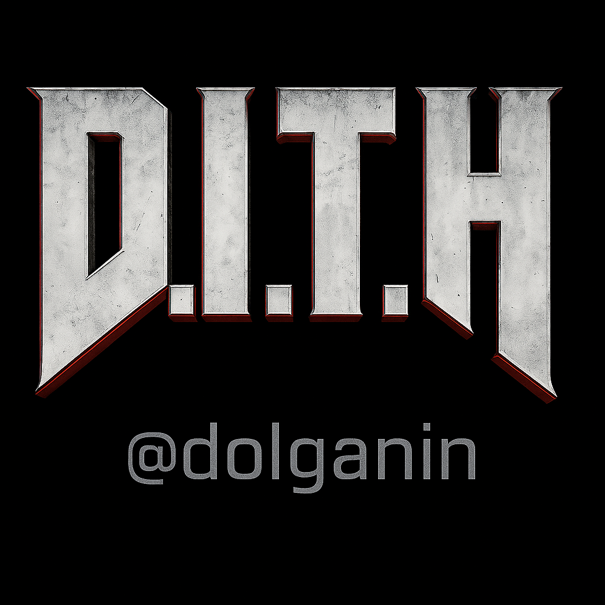

# D.I.T.H.


Система исполнения агентного поведения в мультиплеерной среде Doom с элементами адаптации к игроку.

## Основные идеи

Агент участвует в матче с игроком, используя три политики:
- Пацифист
- Нормальный
- Штурмовик

На основе статистики игрока (движение, урон, смерти) агент плавно сдвигает стратегию через взвешенное голосование моделей. Старые наблюдения забываются экспоненциально (momentum).

## Сценарий запуска

```bash
./install_and_run.sh
```

Запускается два процесса:
- `host.py` — запускает карту с игроком в режиме `SPECTATOR`
- `bot.py` — подключается как `PLAYER`, адаптируясь к поведению

## Архитектура

```text
┌────────────┐   join   ┌────────────┐
│  host.py   │◀────────│  bot.py    │
│ (игрок)    │         │ (агент)    │
└────────────┘         └────────────┘
      ▲                        ▲
      │                        │
      ▼                        ▼
 VizDoom <—— ensemble.py — модельное голосование
```

## Конфигурация

Адаптивность задаётся в `conquest.yaml`:
```yaml
bots:
  start_wave: 5
  interval: 2
  skill_base: 1
  skill_step: 1
  max_skill: 5
  classes: ["MarineShotgun", "MarineChaingun"]
```

Экстренные патроны для баланса:
```yaml
extra_ammo_type:
  - {type: "ShellBox",  min_damage: 35}
  - {type: "CellPack",  min_damage: 5}
  - {type: "CellPack",  min_damage: 100}
```

## Поведение

Если моделей нет — агент действует случайно.  
В бою — выбирает действия по результату softmax-взвешивания.

## Лицензия

Для исследовательских и демонстрационных целей.
